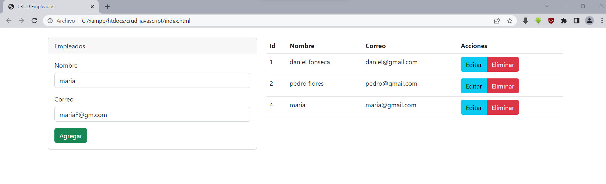

# CRUD con JavaScript Vanilla y PHP

Descripción:
este es un proyecto que cumple las funciones básicas de un CRUD de "empleados", creado con JavaScript
y con una base de datos en MySQL, ademés de que las consultas a la BD se generan mediante una API en PHP.

Imágenes ilustrativas:

